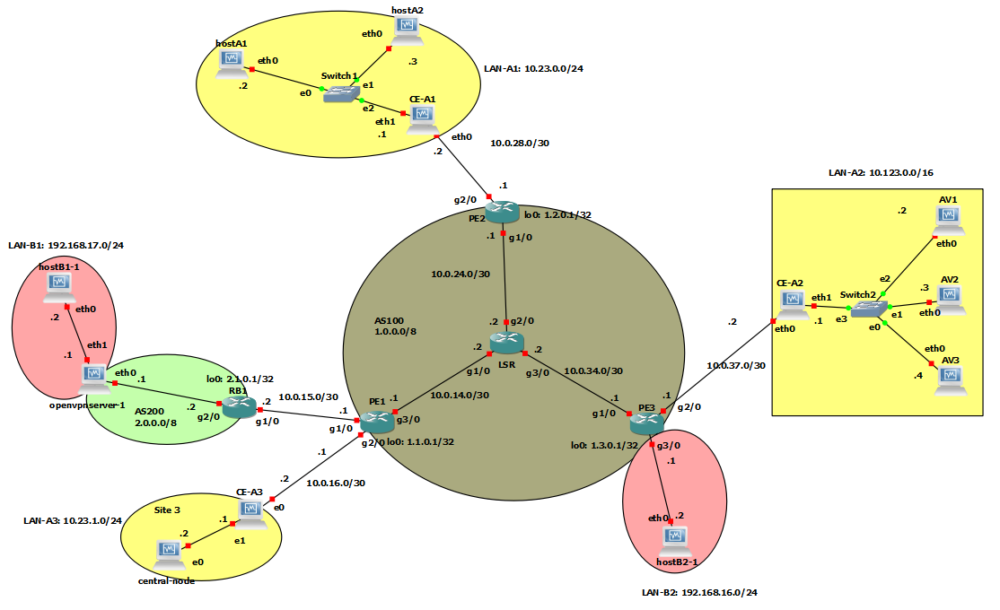
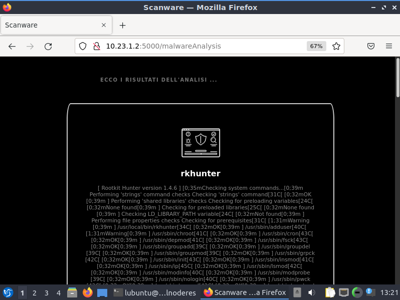

# Network and System Defence
### Progetto Finale #2 A.A. 2022/2023

Relazione per il progetto di NSD (Laurea Magistrale in Ingegneria Informatica):
* Capotombolo Luca (0316166)
* Venditti Elisa   (0315909)
<!-- TABLE OF CONTENTS -->
<details>
  <summary>Contenuti</summary>
  <ol>
    <li>
      <a href="#Specifiche-progetto">Specifiche progetto</a>
    </li>
    <li>
      <a href="#Routers">Routers</a>
    </li>
    <li>
      <a href="#LAN-B">LAN B</a>
      <ul>
        <li><a href="#PASSO-1:-configurare-la-rete">PASSO 1: configurare la rete</a></li>
        <li><a href="#PASSO-2:-generazione-dei-certificati-e-delle-chiavi">PASSO 2: generazione dei certificati e delle chiavi</a></li>
        <li><a href="#PASSO-3:-configurazione-di-openvpn">PASSO 3: configurazione di openvpn</a></li>
      </ul>
    </li>
    <li>
      <a href="#LAN-A">LAN A</a>
      <ul>
        <li><a href="#A1:-MACSEC-E-FIREWALL">A1: MACSEC E FIREWALL</a></li>
        <li><a href="#A2-E-A3:-FIREWALL">A2 E A3: FIREWALL</a></li>
        <li><a href="#A2-E-A3:-SISTEMA DISTRIBUITO">A2 E A3: SISTEMA DISTRIBUITO</a></li>
      </ul>
    </li>
  </ol>
</details>

## Specifiche progetto



Nel progetto è richiesta la realizzazione di una rete composta da 2 sistemi autonomi (AS100 e AS200) che forniscono la connettività a cinque reti private.

* L’AS100 fornisce il servizio VPN BGP/MPLS ai siti della VPN A per cui crea una topologia “_hub-and-spoke_”.
*	Il server presente nell’AS200 fornisce un’overlay VPN per il client nella LAN B1. 

Nella LAN-A1 i dispositivi comunicano tramite MACsec e sono protetti da un firewall implementato nel gateway. Gli altri due siti della VPN A rappresentano un ambiente virtualizzato per testare la presenza di malware su file binari. Il nodo centrale è l’unico punto pubblicamente accessibile per invocare questo servizio. Infatti, gli antivirus si trovano in un altro sito della VPN A e sono protetti da un firewall. È richiesto il ripristino di snapshot puliti dopo l’esecuzione del malware da parte degli antivirus.
<br/></br>


## Routers
Per prima cosa bisogna configurare le interfacce. Data la sua completezza, di seguito useremo come esempio la configurazione delle interfacce per il PE3:
```
# Configurazione interfaccia di Loopback
int lo0
 ip address 1.3.0.1 255.255.255.255
!
 
# Configurazione interfaccia verso LSR
int g1/0
 ip addr 10.0.34.1 255.255.255.252
 ip nat outside
 mpls ip
 no shut
!

# Configurazione interfaccia verso LAN A3
int g2/0
 # Associo la VRF istance con g2/0
 ip vrf forwarding vpnA
 ip addr 10.0.37.1 255.255.255.252
 no shut
!

# Configurazione interfaccia verso Customer B
int g3/0
 ip addr 192.168.16.1 255.255.255.0
 ip nat inside
 no shut
!

# Definisco un'ACL per capire quali pacchetti mascherare
# La nat viene usata solo per i pacchetti che fanno il matching con l'ACL
access-list 101 permit ip 192.168.16.0 0.0.0.255 any 
ip nat inside source list 101 interface lo0 overload
```

Dopo la configurazione dell’indirizzo di ogni interfaccia, i comandi si diversificano: 
* Le interfacce collegate direttamente con una rete privata devono offrire un servizio di NAT. Bisogna specificare quali sono le interfacce interne e quali sono quelle esterne. Infine, abbiamo creato una ACL per permettere solo il traffico interessato e per tradurre l’indirizzo sorgente dei pacchetti che escono dalla rete privata con l’indirizzo di loopback.
* Le interfacce fisiche vanno esplicitamente mantenute abilitate con il comando ```no shutdown```.
* Le interfacce interne all’AS devono abilitare il forwarding MPLS dei pacchetti ipv4 con ```mpls ip``` per poter offrire il servizio di VPN BGP/MPLS.
* Le interfacce esterne che sono direttamente connesse ai siti della VPN BGP/MPLS devono attivare il protocollo VRF tramite il comando ```ip vrf forwarding vpnA```. Il VRF, ovviamente, va creato a priori: 
<br/></br>
  ```
  ip vrf vpnA
   rd 100:0
   route-target export 100:1
   route-target import 100:2
   !
  ```
  Il route distinguisher è 100 per la VPN A e, nel nostro caso, è anche l’unico perché non esistono altre VPN da creare con BGP/MPLS. Il route target ci serve per creare la topologia “_hub-and-spoke_”: 1 identifica l’_hub_ e 2 lo _spoke_. Nell’esempio osserviamo le direttive per l’_hub_ presente dietro il router R3. Viene specificato di esportare i pacchetti con il route target associato all’_hub_ e di importare solo i pacchetti provenienti dagli _spoke_.


### OSPF
Una volta completate le interfacce si deve abilitare il routing OSPF. Nell’esempio mostriamo come il router R3 esporti le reti a lui connesse: 1.3.0.1/32 e 10.0.34.0/30.
```
router ospf 1
 router-id 1.3.0.1
 network 1.3.0.1 0.0.0.0 area 0
 network 10.0.34.0 0.0.0.3 area 0
!
```
### BGP
Per l’LSR la configurazione termina con i precedenti passaggi. <br/></br>
Tutti gli altri router, invece, devono configurare il processo BGP. In particolare, i router appartenenti all’AS100 devono creare una full-mesh tra di loro per ricevere tutte le rotte senza avere il problema dei loop. Ogni router elenca i suoi vicini e ne specifica l’appartenenza ad un sistema autonomo. 
```
router bgp 100
 # Full mesh topology PE
 neighbor 1.2.0.1 remote-as 100
 neighbor 1.2.0.1 update-source lo0
 neighbor 1.2.0.1 next-hop-self
 neighbor 1.1.0.1 remote-as 100
 neighbor 1.1.0.1 update-source lo0
 neighbor 1.1.0.1 next-hop-self
```

<br/></br>
Per scambiare informazioni eterogenee con BGP utilizziamo la sua estensione MP-iBGP. In particolare bisogna:
1.	Permettere lo scambio di informazioni di routing MPLS VPN (_vpnv4_). Sono coinvolti tutti i router di bordo in quanto ognuno di loro è collegato ad un sito della VPN da gestire con queste modalità.
    ```
    address-family vpnv4
     neighbor 1.2.0.1 activate
     neighbor 1.2.0.1 send-community extended
     neighbor 1.2.0.1 next-hop-self
     neighbor 1.1.0.1 activate
     neighbor 1.1.0.1 send-community extended
     neighbor 1.1.0.1 next-hop-self
     exit-address-family
    ```
2.	Permettere lo scambio di informazioni di routing IP associate ad uno specifico VRF. In questo caso R3 esporta anche la rotta generica 10.23.0.0/16 in modo che i due _spoke_ possano parlare tramite l’_hub_.
    ```
    address-family ipv4 vrf vpnA
     network 10.123.0.0 mask 255.255.0.0
     network 10.23.0.0 mask 255.255.0.0
     exit-address-family
    ```
Per concludere la configurazione dei router, abbiamo aggiunto le rotte.
-	_Rotte specifiche per le VRF_ in modo da indirizzare i pacchetti verso l’interfaccia corretta
    ```
    ip route vrf vpnA 10.23.0.0 255.255.0.0 10.0.37.2
    ip route vrf vpnA 10.123.0.0 255.255.0.0 10.0.37.2
    ```

-	_Rotte fasulle_ per simulare la gestione della rete

	```ip route 1.0.0.0 255.0.0.0 Null0```

-	Nell’unico router dell’AS200 abbiamo inserito una rotta di default verso l’AS100 in modo da esplicitare la sua relazione di “_customer_” con quest’ultimo.


<br/></br>
## LAN B
La LAN B possiede due siti: uno collegato all’AS100 e uno all’AS200.  Questi due siti devono far parte di una VPN creata con OpenVPN. L’hostB2 è l’unico client che sfrutta il server per poter comunicare con l’hostB1 nella rete privata remota.

### PASSO 1: configurare la rete
Non ci sono particolarità nella configurazione di rete. È bene solo notare come il server abiliti _forwarding_ e _masquerade_ in modo che l’hostB1 possa comunicare con l’esterno.

### PASSO 2: generazione dei certificati e delle chiavi
Per generare il materiale crittografico (presente in *[pki](./LAN&#32;B/criptographic&#32;material/pki "pki")*) abbiamo utilizzato _easy-rsa_. Il server ha svolto la funzione di certification authority e ha eseguito i comandi elencati di seguito:
```
./easyrsa init-pki
./easyrsa build-ca
./easyrsa build-server-full server
./easyrsa build-client-full client
./easyrsa gen-dh
```
I file generati sono i parametri di diffie-hellman, certificati e chiavi private di client, server e certification authority.

### PASSO 3: configurazione di openvpn
Il server ha la seguente configurazione (*[server.ovpn](./LAN&#32;B/config&#32;ovpn/server.ovpn "server.ovpn")*): 
```
port 1194
proto udp
dev tun

ca ca.crt
cert issued/server.crt
key private/server.key
dh dh.pem

server 192.168.100.0 255.255.255.0
push "route 192.168.17.0 255.255.255.0"

client-config-dir ccd
keepalive 10 120
cipher AES-256-CBC
```
Con i comando ```server``` indichiamo il range di indirizzi appartenenti alla rete overlay (di cui il server prenderà il primo utile: 192.168.100.1). Con il comando ```push```, invece, avvertiamo il client che dietro il server c’è la rete 192.168.17.0/24. In questo modo viene modificato l’underlay routing del client che dovrà avvalersi della rete overlay per poter raggiungere 192.168.17.0/24.
Nella cartella ccd è presente un file di configurazione (*[client](./LAN&#32;B/config&#32;ovpn/ccd/client "client")*) che assegna all’unico client presente gli indirizzi nella rete overlay: ```ifconfig-push 192.168.100.101 192.168.100.102```.
Lato client viene specificata un’altra configurazione (*[client.ovpn](./LAN&#32;B/config&#32;ovpn/client.ovpn "client.ovpn")*):

```
client
proto udp
dev tun

remote 2.0.0.1 1194
resolv-retry infinite

ca ca.crt
cert client.crt
key client.key

remote-cert-tls server
cipher AES-256-CBC
```

È importante notare come vengano indicati IP pubblico e PORTA del server di OPENVPN.
Riassumendo, l’hostB1 può comunicare:
-	con l’esterno perché il server maschera il suo indirizzo sorgente;
-	con l’hostB2 grazie alla rete overlay, quindi utilizzando l’indirizzo 192.168.100.101.
Viceversa, l’hostB2 può comunicare con l’hostB1 perché il server ha annunciato la rete 192.168.17.0/24 e ha modificato l’underlay routing del client (hostB2).
<br/></br>


## LAN A
I tre siti della VPN A sono connessi logicamente con una topologia "_hub-and-spoke_". 
### A1: MACSEC E FIREWALL
Nella LAN A1 i tre dispositivi devono comunicare in modo sicuro con MACSEC. Per lo scambio delle chiavi, non previsto in MACSEC, abbiamo utilizzato il protocollo MACSEC Key Agreement definito in 802.1X. 

Per prima cosa va definita la "_pre-shared key_" (CAK) da cui derivare il materiale crittografico e il Connectivity Association Key Name (CKN). In seguito, dopo aver eliminato eventuali connessioni già presenti, viene creata la connessione di tipo macsec identificata dal nome _macsec-connection_. L'interfaccia "_parent_" cambia in base al dispositivo su cui si eseguono i comandi: in questo caso, si tratta del CE_A1 e l'interfaccia selezionata è enp0s8 (interna alla LAN). L'indirizzo utilizzato è quello che corrisponde all'intrefaccia su cui si opera con macsec. Il comando ```ipv4.method manual``` è stato inserito per evitare disconnessioni continue da parte dei dispositivi.
```
export MKA_CAK=00112233445566778899aabbccddeeff 
export MKA_CKN=00112233445566778899aabbccddeeff00112233445566778899aabbccddeeff

nmcli 	connection delete macsec-connection
nmcli 	connection add type macsec \
	con-name macsec-connection \
	ifname macsec0 connection.autoconnect no \
	macsec.parent enp0s8 \
	macsec.mode psk \
	macsec.mka-cak $MKA_CAK \
	macsec.mka-cak-flags 0 \
	macsec.mka-ckn $MKA_CKN \
	ipv4.method manual \
	ipv4.address 10.23.0.1/24
```

In aggiunta, il CE_A1 deve proteggere la LAN con un firewall: *[firewall_CE_A1.sh](./LAN&#32;A/A1/firewall_CE_A1.sh "firewall_CE_A1.sh")*.

1. ___Permettere il traffico tra LAN e rete esterna solo se iniziato dalla LAN___. Abbiamo negato tutto il traffico inoltrato per poi definire delle eccezioni. Le connessioni nuove vengono accettate solo se provenienti dalla LAN all’esterno. La seconda regola mostrata di seguito è stata inserita per consentire al traffico di risposta di poter raggiungere la LAN. 
    ```
    iptables -P FORWARD DROP
    iptables -A FORWARD -m state --state ESTABLISHED -j ACCEPT
    iptables -A FORWARD -i $LAN -o $EXT -j ACCEPT
    iptables -A POSTROUTING -t nat -o $EXT -j SNAT --to-source 10.23.0.1 
    ```
    I pacchetti uscenti dalla LAN, come da richiesta, subiscono una source NAT. Abbiamo inserito la SNAT e non la MASQUERADE in modo che il pacchetto potesse essere inoltrato correttamente dalla VRF.

2. ___Negare tutto il traffico diretto al GW tranne ssh e ICMP se iniziati dalla LAN___. Per prima cosa è stato respinto tutto il traffico in input per poi definire le eccezioni richieste. 
    ```
    iptables -P INPUT DROP 
    iptables -A INPUT -i $LAN -p tcp --dport  22 -j ACCEPT
    iptables -A INPUT -i $LAN -p icmp -j ACCEPT 
    ```

3. ___Permettere il traffico dal GW diretto ovunque e permettere le relative risposte___. Il traffico in output viene accettato per default. Per consentire anche le risposte, il traffico in input al GW relativo alle connessioni già stabilite deve essere consentito.
    ```
    iptables -P OUTPUT ACCEPT 
    iptables -A INPUT -m state --state ESTABLISHED -j ACCEPT
    ```
    
4. ___Permettere il port forwarding con la DNAT dalla rete esterna agli hostA1 e hostA2 (solo per il traffico HTTP)___. Con il port forwarding possiamo inserire una sola destinazione. Dunque, per consentire la comunicazione verso entrambi gli host della LAN A1, abbiamo inserito un meccanismo di round robin. Ovviamente il traffico HTTP deve essere consentito.
    ```
    iptables -A PREROUTING -t nat -i $EXT -p tcp --dport 80 -m statistic --mode nth --every 2 --packet 0 -j DNAT --to-destination 10.23.0.2:80
    iptables -A PREROUTING -t nat -i $EXT -p tcp --dport 80 -m statistic --mode nth --every 1 --packet 0 -j DNAT --to-destination 10.23.0.3:80
    iptables -A FORWARD -i $EXT -o $LAN -p tcp --dport 80 -j ACCEPT
    ```


### A2 E A3: FIREWALL
Le LAN A2 e A3 ospitano un ambiente virtualizzato per la scansione di file binari. Nella prima LAN è presente un nodo centrale con cui si interagisce per sottomettere i file da analizzare e per consultare i report degli antivirus. La seconda LAN, invece, contiene tre macchine virtuali su cui vengono eseguite le scansioni. Data la sensibilità del sito, deve essere inserito un firewall in CE_A2 (*[firewall_CE_A2.sh](./LAN&#32;A/A2/firewall_CE_A2.sh "firewall_CE_A2.sh")*) che consente solamente il traffico da/verso il central node.

Di default viene scartato tutto il traffico.
```
iptables -P FORWARD DROP
iptables -P INPUT DROP 
iptables -P OUTPUT DROP
```
Bisogna accettare le connessioni dal nodo centrale agli antivirus e viceversa. Per indicare gli end host abbiamo inserito un intervallo di indirizzi 10.123.0.0/16. In quest’intervallo rientra anche il CE_A2 (ip 10.123.0.1): il traffico verso questo dispositivo non è comunque consentito in quanto le regole riguardano il forwarding e non l’input.
```
iptables -A FORWARD -i $EXT -o $LAN -s 10.23.1.2 -d 10.123.0.0/16 -j ACCEPT
iptables -A FORWARD -i $LAN -o $EXT -s 10.123.0.0/16 -d 10.23.1.2 -j ACCEPT
```

L’unica eccezione alle regole precedenti sono le connessioni tra gli _spoke_. Se il CE_A2 (_hub_) non inoltrasse il traffico tra gli _spoke_ non avremmo più connessione tra LAN A1 e LAN A3.
```
iptables -A FORWARD -i $EXT -o $EXT -s 10.23.0.0/24 -d 10.23.1.0/24 -j ACCEPT
iptables -A FORWARD -i $EXT -o $EXT -s 10.23.1.0/24 -d 10.23.0.0/24 -j ACCEPT
```


### A2 E A3: SISTEMA DISTRIBUITO
Nel nodo centrale abbiamo utilizzato il framework Flask per la realizzazione di un'applicazione web a cui sottomettere i file binari da analizzare. Poichè la comunicazione con gli antivirus non è locale ma si estende (potenzialmente) su scala geografica, abbiamo utilizzato il framework gRPC per le chiamate a procedura remota. I servizi offerti sono:
* ___sendAck___ - offerto dal nodo centrale. Viene invocato dagli antivirus in modo da comunicare al nodo centrale il completamento di task di setup. 
* ___sendBinary___ - offerto dagli antivirus. Viene invocato dal nodo centrale per spedire il file da analizzare e ricevere il relativo report.

L'interazione tra i dispositivi viene descritta nei seguenti punti.
1. Il server attende che il numero di ack ricevuti sia pari al numero atteso di antivirus. Per far questo, viene creato un nuovo thread che crea il server gRPC per il servizio _sendAck_ e, una volta ricevuti gli ack attesi, termina il server in modo da non sprecare risorse.
2. Ricevuti gli ack, il nodo centrale si occupa di creare uno snapshot pulito per gli antivirus. In realtà è l'host ad eseguire materialmente questo compito: rimane in ascolto su una socket (*[nsd-socket.py](./LAN&#32;A/Distributed&#32;System/nsd-socket.py "nsd-socket.py")*) attendendo le richieste da parte del central node. Ricevuta la richiesta, l'host si occupa di eseguire i file .bat per la creazione di uno snapshot direttamente su Virtual Box:
	```
	VBoxManage snapshot Lubuntu6-big take safe4-env
	```
3. Terminata la creazione degli snapshot, l'utente può immettere un file per la scansione. Questo viene inviato agli antivirus tramite il servizio _sendBinary_ che, come risultato, restituisce il report della scansione. Le sequenze di byte vengono opportunamente divise in chunk in modo da essere spedite come stream. (__concetto da migliorare__).

https://user-images.githubusercontent.com/57570854/234013949-2cb2388e-50e6-41ac-a6af-915cb0ea2d9f.mp4



4. Se si vuole richiedere una seconda scansione bisogna ripristinare lo snapshot pulito per gli antivirus. Ancora una volta si delega all'host questo compito seguendo lo stesso procedimento del punto (2). I comandi da eseguire sono:
	```
	VBoxManage controlvm Lubuntu6-big poweroff
	VBoxManage snapshot Lubuntu6-big restore safe4-env
	VBoxManage startvm Lubuntu6-big
	```
I tre antivirus utilizzati sono:
* clamav
* rkhunter
* chkrootkit


